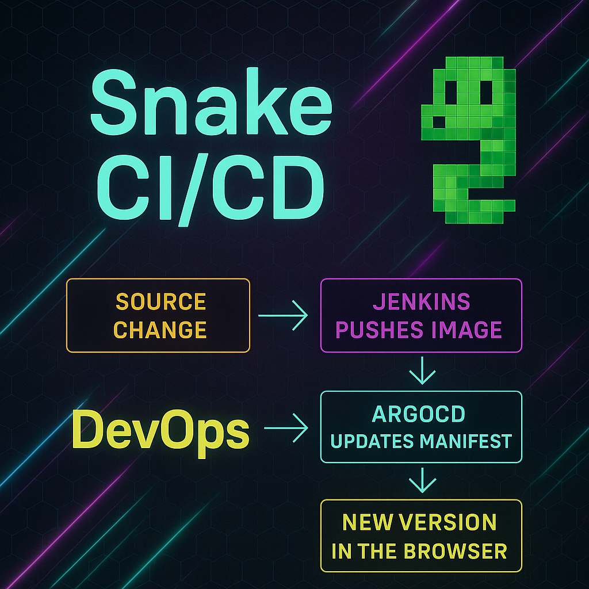

# SnakeCICD: DevOps Automation Projects

Welcome to a showcase of hands-on, production-grade DevOps projects designed to demonstrate practical proficiency in CI/CD, GitOps, Kubernetes, and modern infrastructure automation. Built for real-world application, these projects exemplify what a Junior+ DevOps Engineer can deliver when blending automation with thoughtful design.
 
---
## 📅 Purpose
These repositories were created as part of my journey to break through the "demo-project" barrier and into production-ready DevOps engineering. Each project is fully functional, automated, and integrates multiple real-world tools used in modern software delivery pipelines.

---
## 🔄 SnakeCICD
**Project Goal:** Automatically build, test, and deploy a Snake game web app using Jenkins, Docker, and Kubernetes.

### 🔄 Flow Overview
1. Developer pushes changes to the Snake game (HTML-based).
2. Jenkins picks up the change and triggers a pipeline.
3. Jenkins builds and pushes the Docker image to GitHub Container Registry.
4. Kubernetes detects the new image version (via systemd timer) and auto-updates the deployment.
5. ArgoCD monitors GitHub repository for config changes (manually synced due to local setup).

### ⚙️ Key Technologies:
- Jenkins (main CI/CD driver)
- GitHub Container Registry (image storage)
- Kubernetes (kubeadm cluster, 1 master + 2 nodes)
- ArgoCD (GitOps tool)
- Docker (containerization)
- systemd (to trigger image update script)
- HTML (frontend)

### 🖇 Highlights:
- Full CI/CD with image building, tagging, and deployment
- GitOps config separation for ArgoCD
- ArgoCD ready for auto-sync (with Sync+Prune manually now)

**Repository:** [SnakeCICD GitHub Repo](https://github.com/DanyAAD90/snakecicd)

---
## 🧹 Why It Matters (Recruiter-Focused)
These projects aren't "just another Hello World" — they represent:

- Real DevOps experience with distributed systems
- Hands-on knowledge of tools used in production
- Awareness of SRE principles (resilience, observability, security)
- Ability to design, build, and operate modern infrastructure
- Projects you can **clone, test, verify**, and **see running**

---
## 🌟 Want To Talk?
If you're a recruiter or hiring manager:
- I'm actively looking for a **Junior DevOps** or **Infrastructure Engineer** role
- Passionate about Kubernetes, GitOps, and clean automation
- Open to relocation or remote

**Contact:** [LinkedIn](https://www.linkedin.com/in/daniel-zdun)

---
## 🌟 Bonus: Built Using Best Practices
- YAML linted & validated
- Folder structure separated by environment
- All source-controlled
- ArgoCD manifests decoupled from app source
- Minimalist, clean, reusable

---

---
> "Don’t just say you know DevOps. **Show** it, in action."

---
