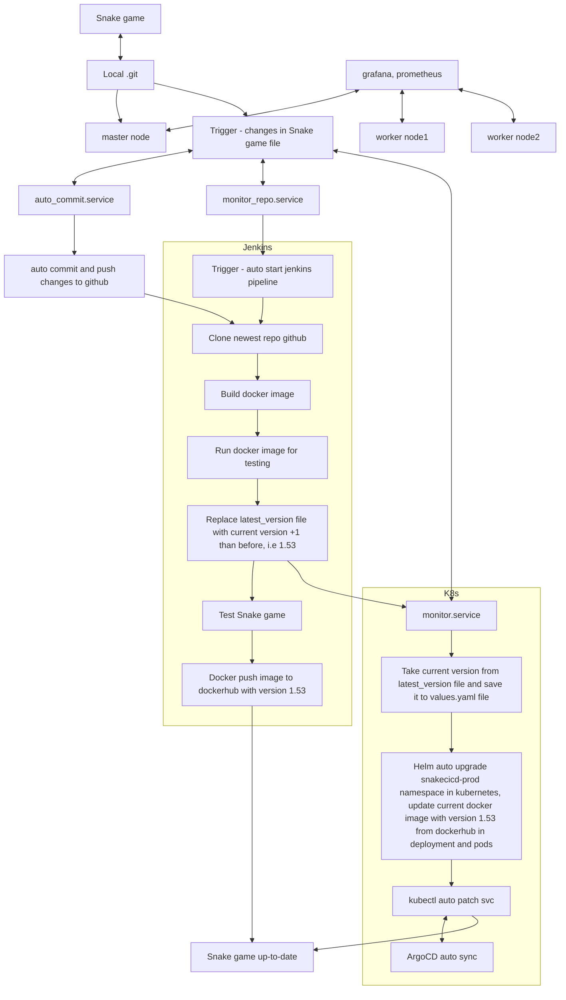
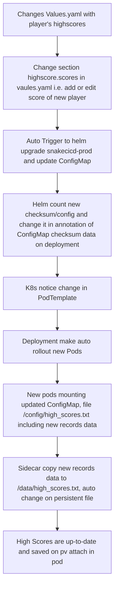

# Zalozenia projektu gry snake w oparciu o CICD:
- Repozytorium w folderze snake/ z plikami oraz docker-compose to utworzenia jenkins w kontenerze oraz index.html z gra snake
- Kazda zmiana w kodzie index.html lub w jakakolwiek w repozytorium lokalnym powoduje automatyczny commit oraz pushowanie do github na podstawie dodanego serwisu auto_commit.service w systemd
## Continous Integration + Continous Delivery na dockerhub jenkins pipeline:
  - kopiuje repo z github do swojej przestrzeni kontenera jenkins w /var/jenkins_home/workspace/snake_pipeline/
  - testuje kod index.html -> jesli blad składni to zatrzymuje proces
  - tworzy obraz docker np do wersji 15
  - pushuje nowa wersje na dockerhub (Continous Delivery)
  - sprawdza czy jest polaczenie curl
  - uruchamia aplikacje snake na stagingu pod adresem 192.168.18.165:8321
  - zapisuje logi
## Realizacja calkowitej automatyzacji Continous Delivery na kubernetes:
  - monitor_repo.service uruchamia monitor_repo.sh w snakecicd_monitor/ i sprawdza czy nastapila zmiana w kodzie gry (index.html) w lokalnym repozytorium, jeśli tak to wykonaj pipeline za pomoca Jenkins CLI
  - monitor.service uruchamia monitor.sh w snakecicd_monitor/ i sprawdza zmianę wersji dostarczoną przez jenkins w pliku latest_version na maszynie lokalnej, która pojawi się po wykonaniu pipeline. Jeśli tak, to aktualizuje wartość w pliku values.yaml na podstawie której automatycznie aktualizowany jest obraz image w deploymencie snakecicd-prod na kubernetes
  - aplikacja jest up-to-date na produkcji w srodowisku kubernetes z deploymentem, servisem oraz dwoma replikami podów pod adresem http://192.168.18.165:8321 (Continous Delivery)
  ## Workflow procesu aktualizacji github, dockerhub and deployment kubernetes po zmianie kodu gry Snake:

## Architektura Klastra K8s dla Snake game ##

Poszczególne elementy, z których zbudowana jest infrastruktura:
| Typ | Nazwa | Działanie |
|-----|-------|-----------|
| Namespace | snakecicd-prod | - |
| Deployment | snakecicd-prod | zawiera InitContainer, App oraz Sidecar Container, obsługuje uruchomienie aplikacji Snake, kopiowanie plików high_scores.txt oraz ich synchronizację |
| ConfigMap | high-scores-cm | klucz high_scores z wpisami rekordów gry, Przechowuje treść pliku high_scores.txt jako dane konfiguracyjne |
| PVC | snakecicd-storage | dynamiczny prosioning za pomoca local-path, trwałe miejsce na zapis rekordów gry Snake w /data |
| PV | pvc-... | dynamicznie utworzony PV | przypisany do PVC przez local-path StorageClass |
| NetworkPolicy | snakecicd-network-policy | ochrona komunikacji aplikacji, ogranicza ruch sieciowy dla gry snake w obrębie namespace |
| HorizontalPodAutoscaler | snakecicd-hpa | dostosowuje ilość podów zależnie od obciążenia cpu na pod, od 2 do 5 |

Dzialanie poszczególnych komponentów:
| Komponent | Nazwa | Funkcja |
|-----------|-------|---------|
| InitContainer | init-copy-highscore | Kopiuje zawartość /config/high_scores.txt (ConfigMap) do /data/high_scores.txt (PVC) przy starcie Poda |
| Główny kontener | snakecicd-prod | Uruchamia grę Snake, dostęp przez serwis TCP:8321 |
| Sidecar | highscore-sync | Co 10 sekund kopiuje zawartość /config/high_scores.txt do /data/high_scores.txt, aktualizując plik na PVC |
| ConfigMap | high-scores-cm | Zawiera wyniki graczy w formie pliku tekstowego |
| PVC | snakecicd-storage | Zapewnia trwałe przechowywanie danych gry (np. wyników high_scores) |
| Helm Chart | - | Definiuje wszystkie zasoby Kubernetes, automatycznie zarządza rolloutem przy zmianach w ConfigMap |

## Workflow zmiany pliku values.yaml z rekordami graczy ##

