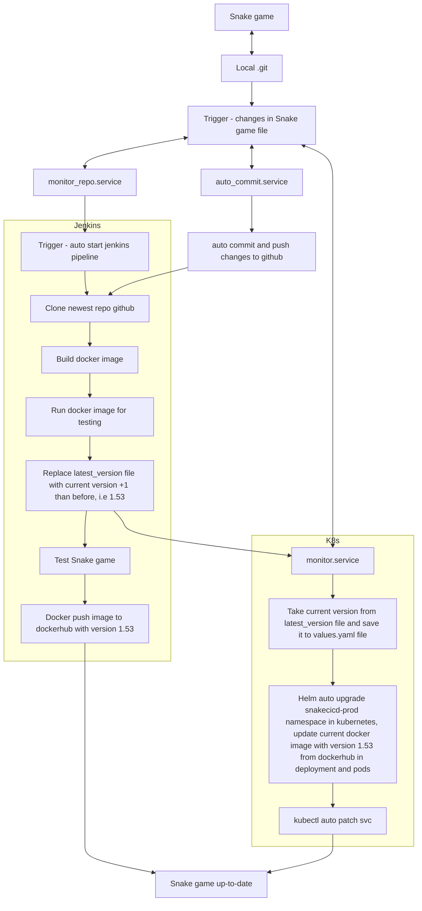

# Zalozenia projektu gry snake w oparciu o CICD:
- Repozytorium w folderze snake/ z plikami oraz docker-compose to utworzenia jenkins w kontenerze oraz index.html z gra snake
- Kazda zmiana w kodzie index.html lub w jakakolwiek w repozytorium lokalnym powoduje automatyczny commit oraz pushowanie do github na podstawie dodanego serwisu auto_commit.service w systemd
## Continous Integration + Continous Delivery na dockerhub jenkins pipeline:
  - kopiuje repo z github do swojej przestrzeni kontenera jenkins w /var/jenkins_home/workspace/snake_pipeline/
  - testuje kod index.html -> jesli blad składni to zatrzymuje proces
  - tworzy obraz docker np do wersji 15
  - pushuje nowa wersje na dockerhub (Continous Delivery)
  - sprawdza czy jest polaczenie curl
  - uruchamia aplikacje snake na stagingu pod adresem 192.168.18.165:8321
  - zapisuje logi
## Realizacja calkowitej automatyzacji Continous Delivery na kubernetes:
  - monitor_repo.service uruchamia monitor_repo.sh w snakecicd_monitor/ i sprawdza czy nastapila zmiana w kodzie gry (index.html) w lokalnym repozytorium, jeśli tak to wykonaj pipeline za pomoca Jenkins CLI
  - monitor.service uruchamia monitor.sh w snakecicd_monitor/ i sprawdza zmianę wersji dostarczoną przez jenkins w pliku latest_version na maszynie lokalnej, która pojawi się po wykonaniu pipeline. Jeśli tak, to aktualizuje wartość w pliku values.yaml na podstawie której automatycznie aktualizowany jest obraz image w deploymencie snakecicd-prod na kubernetes
  - aplikacja jest up-to-date na produkcji w srodowisku kubernetes z deploymentem, servisem oraz dwoma replikami podów pod adresem http://192.168.18.165:8321 (Continous Delivery)
  ## Workflow procesu aktualizacji github, dockerhub and deployment kubernetes:

