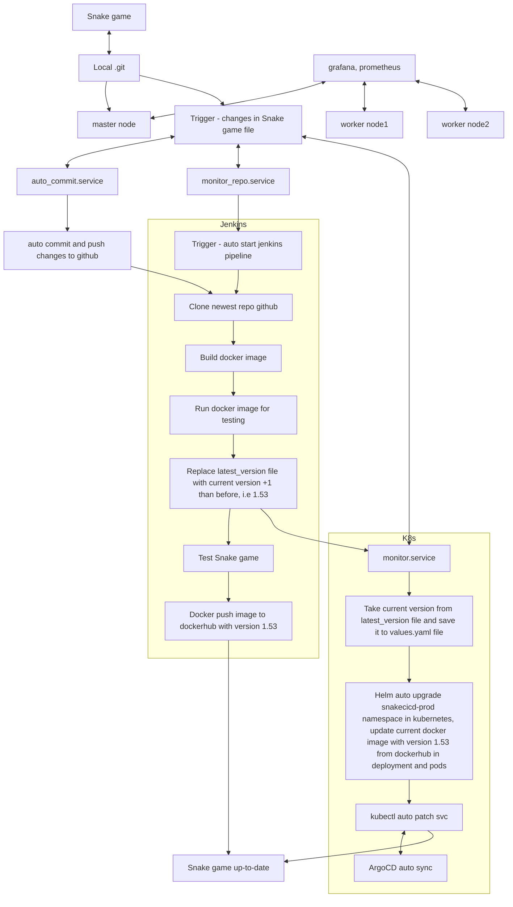
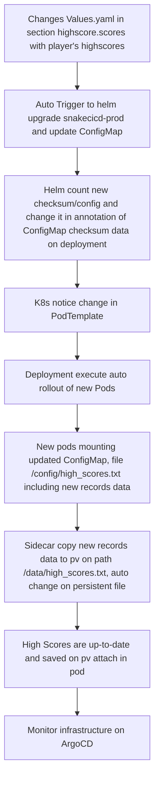

# Project Assumptions for the Snake Game based on CI/CD:
lkll
- The repository is located in the `snake/` folder, containing files and `docker-compose` for creating Jenkins in a container and `index.html` with the Snake game.
- Any change in `index.html` or any file in the local repository triggers an automatic commit and push to GitHub using the `auto_commit.service` configured in `systemd`.

## Continuous Integration + Continuous Delivery on DockerHub via Jenkins Pipeline:

- Clones the repository from GitHub into Jenkins container workspace at `/var/jenkins_home/workspace/snake_pipeline/`
- Tests the `index.html` code – if there's a syntax error, the process stops.
- Builds a Docker image, e.g., version 15.
- Pushes the new version to DockerHub (Continuous Delivery).
- Verifies curl connection.
- Launches the Snake application on staging at `192.168.18.165:8321`.
- Logs are saved.

## Full Continuous Delivery Automation on Kubernetes:

- `monitor_repo.service` launches `monitor_repo.sh` in `snakecicd_monitor/` to detect changes in the game code (`index.html`) in the local repo. If detected, triggers the pipeline using Jenkins CLI.
- `monitor.service` launches `monitor.sh` in `snakecicd_monitor/`, checks for version changes delivered by Jenkins in the `latest_version` file on the local machine (after pipeline execution). If changed, it updates the value in `values.yaml`, which automatically updates the image in the `snakecicd-prod` deployment on Kubernetes.
- The application is up-to-date in the production Kubernetes environment with deployment, service, and two pod replicas at `http://192.168.18.165:8321` (Continuous Delivery).

## Workflow of Updating GitHub, DockerHub, and Kubernetes Deployment after Snake Code Change:

## K8s Cluster Architecture for Snake Game ##

Infrastructure components:

| Type | Name | Description |
|------|------|-------------|
| Namespace | snakecicd-prod | - |
| Deployment | snakecicd-prod | Contains InitContainer, App, and Sidecar Container, responsible for launching the Snake app, copying `high_scores.txt` and syncing it |
| ConfigMap | high-scores-cm | Contains the `high_scores` key with game record entries; stores `high_scores.txt` content as config |
| PVC | snakecicd-storage | Dynamic provisioning via `local-path`, persistent storage for game scores in `/data` |
| PV | pvc-... | Dynamically created and bound to PVC via `local-path` StorageClass |
| NetworkPolicy | snakecicd-network-policy | Secures app communication, limits traffic within the namespace |
| HPA | snakecicd-hpa | Adjusts pod count from 2 to 5 based on CPU usage |
| DaemonSet | prometheus | One pod per node and master, monitors resources and usage |
| StatefulSet | prometheus | Collects, stores, and aggregates metrics from the whole cluster |
| StatefulSet | alertmanager | Stores alerts, notifications, silences |

Component functionalities:

| Component | Name | Function |
|-----------|------|----------|
| InitContainer | init-copy-highscore | Copies `/config/high_scores.txt` (from ConfigMap) to `/data/high_scores.txt` (PVC) at Pod startup |
| Main container | snakecicd-prod | Runs the Snake game, available at TCP:8321 |
| Sidecar | highscore-sync | Every 10s copies `/config/high_scores.txt` to `/data/high_scores.txt`, updating PV |
| ConfigMap | high-scores-cm | Stores player scores in a text file format |
| PVC | snakecicd-storage | Provides persistent storage for game scores |
| Helm Chart | - | Defines all Kubernetes resources, manages automatic rollout on ConfigMap changes |

## Workflow for Updating Player Scores via values.yaml ##

<<<<<<< HEAD
## Licencja
Kod objęty licencją MIT – [zobacz szczegóły](./LICENSE)
=======

## License
Code is licensed under the MIT License – [see details](./LICENSE)
>>>>>>> 93f426c (Updated file: /home/tms_master_1/snake/README.md)
